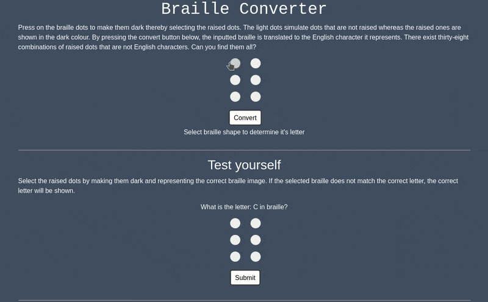

# Braille Converter

## Table of contents
* [Overview](#overview)
* [Examples](#examples)
* [Technologies](#technologies)
* [Usage](#usage)
* [Limitations](#limitations)

## Overview
This website serves as a way to convert and learn braille. The website uses six dots (two columns, three rows) to represent the bumps found on brialle. To represent a *raised* state, the dot turns a dark colour, otherwise the bump is not raised and remains a light colour. The website features to ability to convert braille to and from English alphabet characters. Additionally, you can test yourself and try to beat your own scores!

## Examples

> Screenshot of the full page

## Technologies
- HTML / CSS
- JavaScript

## Usage
There are three main features of the website:  
- Braille to Alphabet
  - you can press on dots to switch them into their *raised* state, and by pressing *convert* the program will determine what alphabet character is represented
- Test Yourself
  - the program will prompt an alphabet character to be represented. If you correctly submit the alphabet character your time will be compared against your top time ever
  - if the alphabet character entered is wrong, however, the correct character will be shown
- Generate Braille
  - alphabet characters can be typed into a text box and equivalent braille will be displayed below

Find the site [here](https://alex0blackwell.github.io/pages/braille/index.html) or in the *portfolio* section of my [website](https://alex0blackwell.github.io/)!

## Limitations
- [ ] Only supports lowercase English Alphabet characters
  - This means the following is not supported:
  - [ ] Uppercase characters
  - [ ] Numbers
  - [ ] Other languages

## License
Licensed under the [GNU General Public License v3.0](LICENSE)
