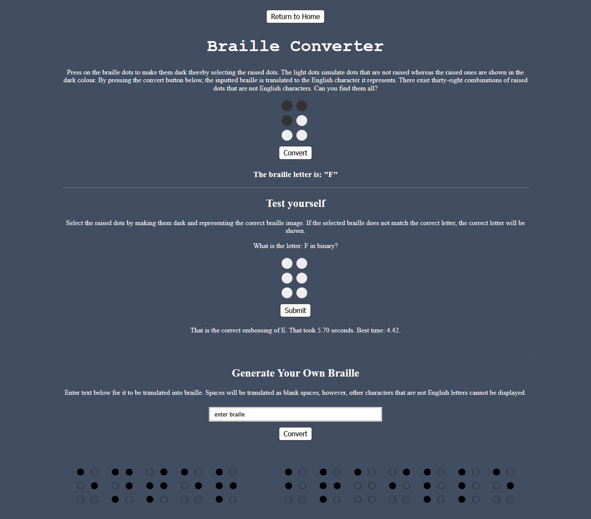

# Convert and Learn Braille
This braille website is a place to learn about how English characters are represented in braille. The website also serves as a method in which to test oneself; English letters can be randomly generated and the user can input the corresponding raised dots to test for correctness. If the correct braille symbol is made and submitted, the time will be recorded and stored in the browser's local memory. If the incorrect braille symbol is created, however, the correct braille combination will be shown below where the braille character was submitted.
The website also includes a feature in which English sentences comprised of letters can be translated into braille sentences.

### The Website is Partially Shown Below:

